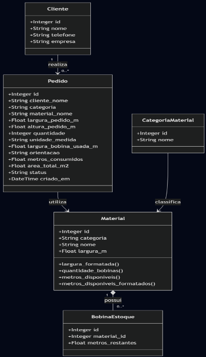
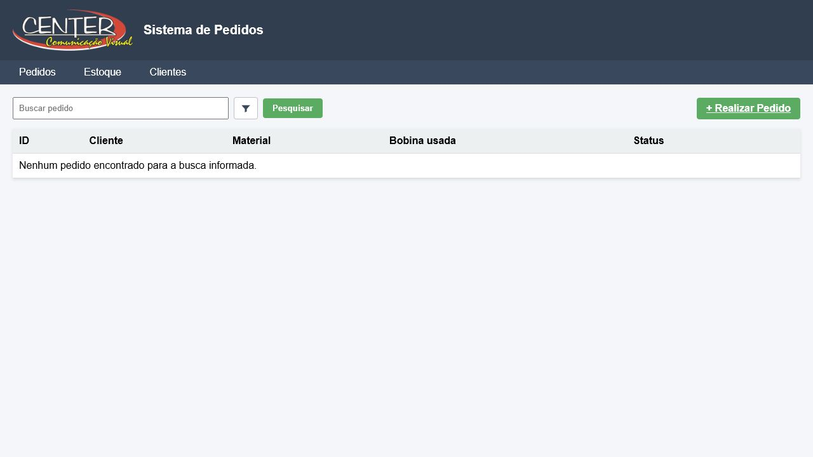
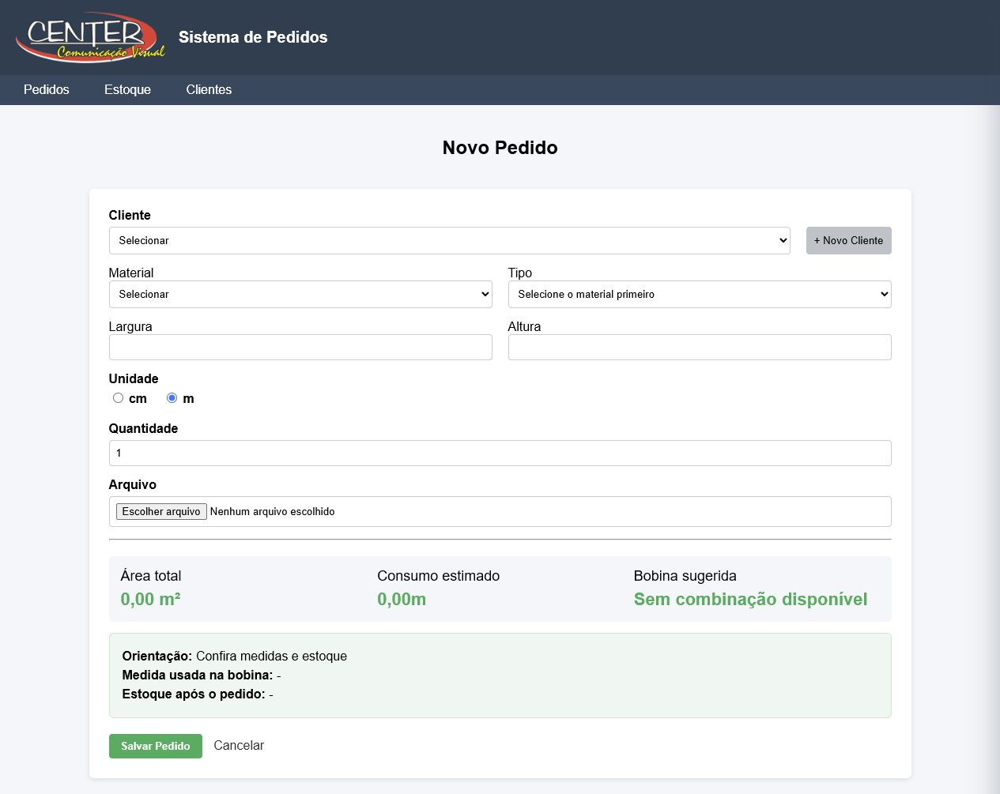
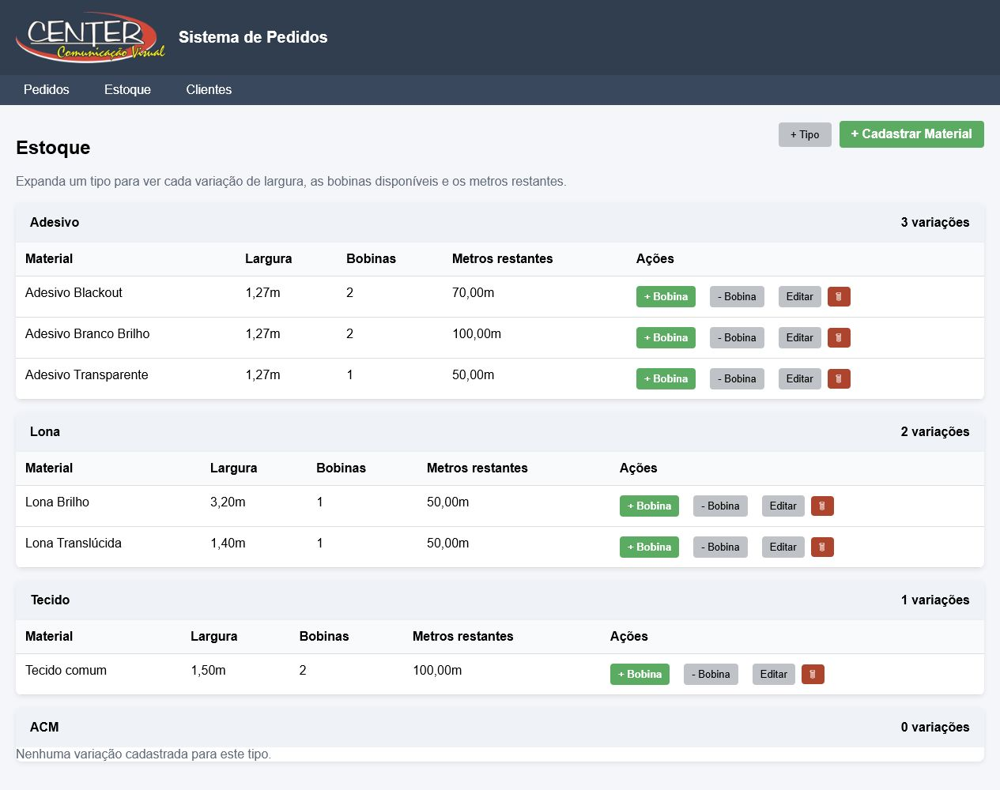
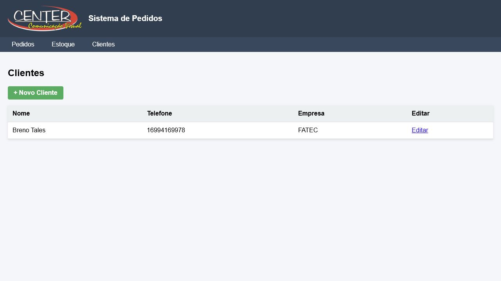

# Sistema de Gestao de Pedidos

## Nome do jogo/aplicativo e descricao

Sistema de Gestao de Pedidos é uma aplicacao web desenvolvida em Python
com Flask para controlar pedidos, clientes e estoque de materiais. O sistema
permite cadastrar clientes, registrar pedidos, calcular o melhor aproveitamento
de bobinas, baixar o estoque automaticamente e acompanhar o status de cada
pedido.

## Integrantes do grupo

Breno Tales de Oliveira Leite | RA: 2840482423029
Daniel Fredi Soares Pereira | RA: 2840482421054

## Tecnologias utilizadas

- Python
- Flask
- Flask-SQLAlchemy
- SQLite
- HTML
- CSS

## Instalacao e execucao

### 1. Criar o ambiente virtual

Criar a venv uma vez:

python -m venv .venv

### 2. Ativar o ambiente virtual

Ativar a venv sempre que for rodar o projeto:

.\.venv\Scripts\Activate.ps1

Se o PowerShell bloquear a ativacao, execute uma vez:

Set-ExecutionPolicy -Scope CurrentUser -ExecutionPolicy RemoteSigned

Depois tente ativar novamente:

```powershell
.\.venv\Scripts\Activate.ps1
```

Quando a venv estiver ativa, o terminal mostra `(.venv)` antes do caminho.

### 3. Instalar as dependencias

Com a venv ativa, instale as dependencias:

python -m pip install -r requirements.txt

### 4. Executar a aplicacao

Com a venv ativa, rode:

python app.py


### 5. Encerrar a aplicacao

Para parar o servidor, pressione `Ctrl + C` no terminal.

Para sair da venv:

deactivate

## Diagrama UML final



## Capturas de tela

### Tela de pedidos



### Tela de novo pedido



### Tela de estoque



### Tela de clientes


