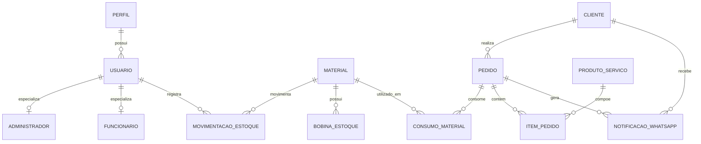

# DER — Sistema Web de Controle de Estoque para Empresa de Comunicação Visual

## 1. Diagrama

## 2. Dicionário de dados

### Tabela: perfil

| Campo | Tipo | Restrições | Descrição |
|---|---|---|---|
| id | INTEGER | PK | Identificador do perfil |
| nome | VARCHAR(50) | NOT NULL, UNIQUE | Nome do perfil |
| descricao | VARCHAR(160) | | Descricao do perfil |

### Tabela: usuario

| Campo | Tipo | Restrições | Descrição |
|---|---|---|---|
| id | INTEGER | PK | Identificador do usuario |
| perfil_id | INTEGER | FK -> perfil.id, NOT NULL | Perfil de acesso do usuario |
| nome | VARCHAR(120) | NOT NULL | Nome do usuario |
| email | VARCHAR(160) | NOT NULL, UNIQUE | E-mail usado no login |
| senha_hash | VARCHAR(255) | NOT NULL | Senha armazenada de forma criptografada |

### Tabela: administrador

| Campo | Tipo | Restrições | Descrição |
|---|---|---|---|
| id | INTEGER | PK | Identificador do administrador |
| usuario_id | INTEGER | FK -> usuario.id, NOT NULL, UNIQUE | Usuario associado ao administrador |

### Tabela: funcionario

| Campo | Tipo | Restrições | Descrição |
|---|---|---|---|
| id | INTEGER | PK | Identificador do funcionario |
| usuario_id | INTEGER | FK -> usuario.id, NOT NULL, UNIQUE | Usuario associado ao funcionario |

### Tabela: cliente

| Campo | Tipo | Restrições | Descrição |
|---|---|---|---|
| id | INTEGER | PK | Identificador do cliente |
| nome | VARCHAR(120) | NOT NULL | Nome do cliente |
| telefone | VARCHAR(20) | | Telefone ou WhatsApp do cliente |
| empresa | VARCHAR(120) | | Empresa do cliente |

### Tabela: pedido

| Campo | Tipo | Restrições | Descrição |
|---|---|---|---|
| id | INTEGER | PK | Identificador do pedido |
| cliente_id | INTEGER | FK -> cliente.id, NOT NULL | Cliente responsavel pelo pedido |
| status | VARCHAR(30) | NOT NULL DEFAULT 'Pagamento pendente' | Status atual do pedido |
| quantidade | INTEGER | NOT NULL, CHECK (quantidade > 0) | Quantidade solicitada |
| area_total_m2 | FLOAT | NOT NULL, CHECK (area_total_m2 >= 0) | Area total do pedido |
| criado_em | DATETIME | NOT NULL | Data de criacao do pedido |

### Tabela: produto_servico

| Campo | Tipo | Restrições | Descrição |
|---|---|---|---|
| id | INTEGER | PK | Identificador do produto ou servico |
| nome | VARCHAR(120) | NOT NULL | Nome do produto ou servico |
| descricao | VARCHAR(255) | | Descricao do produto ou servico |
| valor | FLOAT | CHECK (valor >= 0) | Valor do produto ou servico |

### Tabela: item_pedido

| Campo | Tipo | Restrições | Descrição |
|---|---|---|---|
| id | INTEGER | PK | Identificador do item do pedido |
| pedido_id | INTEGER | FK -> pedido.id, NOT NULL | Pedido ao qual o item pertence |
| produto_servico_id | INTEGER | FK -> produto_servico.id, NOT NULL | Produto ou servico solicitado |
| largura_pedido_m | FLOAT | NOT NULL, CHECK (largura_pedido_m > 0) | Largura informada no pedido |
| altura_pedido_m | FLOAT | NOT NULL, CHECK (altura_pedido_m > 0) | Altura informada no pedido |
| quantidade | INTEGER | NOT NULL, CHECK (quantidade > 0) | Quantidade do item |
| area_total_m2 | FLOAT | NOT NULL, CHECK (area_total_m2 >= 0) | Area total do item |

### Tabela: material

| Campo | Tipo | Restrições | Descrição |
|---|---|---|---|
| id | INTEGER | PK | Identificador do material |
| nome | VARCHAR(120) | NOT NULL | Nome do material |
| categoria | VARCHAR(50) | NOT NULL | Categoria do material |
| codigo_barras | VARCHAR(80) | NOT NULL, UNIQUE | Codigo de barras do material |
| largura_m | FLOAT | NOT NULL, CHECK (largura_m > 0) | Largura do material em metros |
| estoque_minimo | FLOAT | NOT NULL DEFAULT 0, CHECK (estoque_minimo >= 0) | Quantidade minima para alerta |
| UNIQUE (categoria, nome, largura_m) | | UNIQUE | Impede variacao duplicada |

### Tabela: bobina_estoque

| Campo | Tipo | Restrições | Descrição |
|---|---|---|---|
| id | INTEGER | PK | Identificador da bobina |
| material_id | INTEGER | FK -> material.id, NOT NULL | Material ao qual a bobina pertence |
| metros_restantes | FLOAT | NOT NULL DEFAULT 50.0, CHECK (metros_restantes >= 0) | Metragem restante da bobina |

### Tabela: movimentacao_estoque

| Campo | Tipo | Restrições | Descrição |
|---|---|---|---|
| id | INTEGER | PK | Identificador da movimentacao |
| usuario_id | INTEGER | FK -> usuario.id, NOT NULL | Usuario que registrou a movimentacao |
| material_id | INTEGER | FK -> material.id, NOT NULL | Material movimentado |
| tipo | VARCHAR(20) | NOT NULL, CHECK IN ('entrada','saida','ajuste') | Tipo da movimentacao |
| quantidade | FLOAT | NOT NULL, CHECK (quantidade > 0) | Quantidade movimentada |
| data | DATETIME | NOT NULL | Data da movimentacao |

### Tabela: consumo_material (associativa N:N entre pedido e material)

| Campo | Tipo | Restrições | Descrição |
|---|---|---|---|
| id | INTEGER | PK | Identificador do consumo |
| pedido_id | INTEGER | FK -> pedido.id, NOT NULL | Pedido que consumiu o material |
| material_id | INTEGER | FK -> material.id, NOT NULL | Material utilizado no pedido |
| metros_consumidos | FLOAT | NOT NULL, CHECK (metros_consumidos > 0) | Metragem consumida |
| largura_bobina_usada_m | FLOAT | NOT NULL, CHECK (largura_bobina_usada_m > 0) | Largura da bobina usada |
| orientacao | VARCHAR(30) | NOT NULL | Orientacao de aproveitamento do material |

### Tabela: notificacao_whatsapp

| Campo | Tipo | Restrições | Descrição |
|---|---|---|---|
| id | INTEGER | PK | Identificador da notificacao |
| pedido_id | INTEGER | FK -> pedido.id, NOT NULL | Pedido relacionado a notificacao |
| cliente_id | INTEGER | FK -> cliente.id, NOT NULL | Cliente notificado |
| mensagem | VARCHAR(500) | NOT NULL | Mensagem enviada ao cliente |
| data_envio | DATETIME | NOT NULL | Data de envio da notificacao |
| status | VARCHAR(20) | NOT NULL, CHECK IN ('enviada','falha') | Resultado do envio |