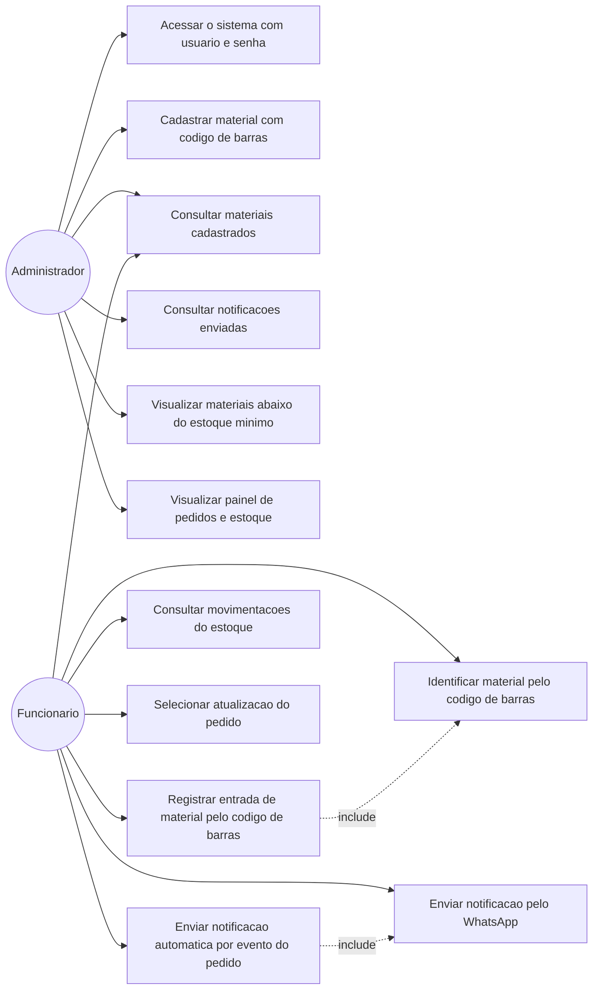
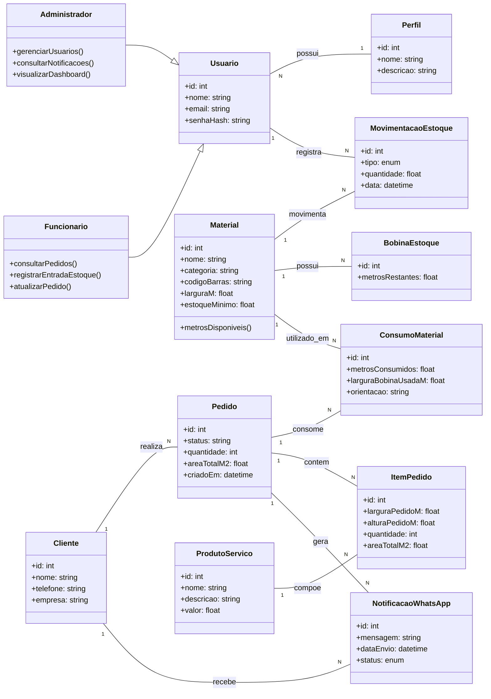

# Diagramas UML — Sistema Web de Controle de Estoque para Empresa de Comunicação Visual

## 1. Diagrama de Casos de Uso

## 2. Diagrama de Classes

## 3. Rastreabilidade — caso de uso - história do backlog

| Caso de uso | História(s) relacionada(s) (E2) |
|---|---|
| Acessar o sistema com usuario e senha | #1 |
| Cadastrar material com codigo de barras | #2 |
| Consultar materiais cadastrados | #3 |
| Identificar material pelo codigo de barras | #4 |
| Registrar entrada de material pelo codigo de barras | #5 |
| Consultar movimentacoes do estoque | #6 |
| Selecionar atualizacao do pedido | #7 |
| Enviar notificacao pelo WhatsApp | #8 |
| Enviar notificacao automatica por evento do pedido | #9 |
| Consultar notificacoes enviadas | #10 |
| Visualizar materiais abaixo do estoque minimo | #11 |
| Visualizar painel de pedidos e estoque | #12 |